``` {#top .header}
            dddddddd                                                         
            d::::::dBBBBBBBBBBBBBBBBB                                         
            d::::::dB::::::::::::::::B                                        
            d::::::dB::::::BBBBBB:::::B                                       
            d:::::d BB:::::B     B:::::B                                      
    ddddddddd:::::d   B::::B     B:::::Buuuuuu    uuuuuu     ggggggggg   ggggg
  dd::::::::::::::d   B::::B     B:::::Bu::::u    u::::u    g:::::::::ggg::::g
 d::::::::::::::::d   B::::BBBBBB:::::B u::::u    u::::u   g:::::::::::::::::g
d:::::::ddddd:::::d   B:::::::::::::BB  u::::u    u::::u  g::::::ggggg::::::gg
d::::::d    d:::::d   B::::BBBBBB:::::B u::::u    u::::u  g:::::g     g:::::g 
d:::::d     d:::::d   B::::B     B:::::Bu::::u    u::::u  g:::::g     g:::::g 
d:::::d     d:::::d   B::::B     B:::::Bu::::u    u::::u  g:::::g     g:::::g 
d:::::d     d:::::d   B::::B     B:::::Bu:::::uuuu:::::u  g::::::g    g:::::g 
d::::::ddddd::::::ddBB:::::BBBBBB::::::Bu:::::::::::::::uug:::::::ggggg:::::g 
 d:::::::::::::::::dB:::::::::::::::::B  u:::::::::::::::u g::::::::::::::::g 
  d:::::::::ddd::::dB::::::::::::::::B    uu::::::::uu:::u  gg::::::::::::::g 
   ddddddddd   dddddBBBBBBBBBBBBBBBBB       uuuuuuuu  uuuu    gggggggg::::::g 
                                                                      g:::::g 
                                                          gggggg      g:::::g 
                                                          g:::::gg   gg:::::g 
                                                           g::::::ggg:::::::g 
                                                            gg:::::::::::::g  
                                                              ggg::::::ggg    
                                                                 gggggg
```

dBug is a simple php 7.1+ class to debug PHP variables such as :
================================================================

-   [String](#string-variable)
-   [Number](#numeric-variable)
-   [Boolean](#boolean-variable)
-   [Null](#null-variable)
-   [Array](#array-variable)
-   [Mysql Query Single Result](#mysql-query-single-result-array)
-   [Mysql Query Multiple Results](#mysql-results-object)
-   [Object](#object-variable)
-   [JSON](#json)
-   [XML](#xml-variable)
-   [PostegreSQL resource](#postgresql-resource)
-   [GD Image resource](#gd-image-resource)
-   [Exif Image information](#exif-image-information)


* * * * * * * * * *

String variable
---------------

```php
<?php
    $emptystring = '';
    new Dbg\dBug2($emptystring);

    $string = 'Lorem ipsum dolor sit amet, consectetur adipiscing elit.';
    new Dbg\dBug2($string);
?>
```
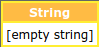


[↑ Top](#top)

* * * * * * * * * *

Numeric variable
----------------

```php
<?php
    $integerVariable = 3;
    new Dbg\dBug2($integerVariable);
            
    $doubleVariable = 3.141592653589793;
    new Dbg\dBug2($doubleVariable);
?>
```
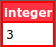

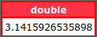

[↑ Top](#top)

* * * * *

Boolean variable
----------------

```php
<?php
    $booleanVariableTrue = true;
    new Dbg\dBug2($booleanVariableTrue);
            
    $booleanVariableFalse = false;
    new Dbg\dBug2($booleanVariableFalse);
?>
```

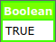

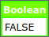

[↑ Top](#top)

* * * * *

Null variable
-------------

```php
<?php
    $nullVariable = null;
    new Dbg\dBug2($nullVariable);
?>
```


[↑ Top](#top)

* * * * *

Array variable
--------------

```php
<?php
    $myArray = [
        'first' => [ ['one'=>1, 'two'=>2], ['three'=>3, 'four'=>4] ],
        'second' => [ [5=>'five', 6=>'six'], [7=>'seven', 8=>'height'] ]
    ];
    new Dbg\dBug2($myArray);
?>
```
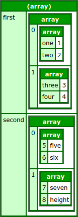

[↑ Top](#top)

* * * * *

Mysql Query Single Result Array
-------------------------------

```php
<?php
    $dblink = mysqli_connect($host, $user, $pw);
    $dblink->set_charset( 'utf8' );
    $dblink->select_db( $db );
    $dbres = $dblink->query("SELECT * FROM `contact` WHERE uid=5");
    new Dbg\dBug2( $dbres->fetch_assoc());
    $dbres->free();
    mysqli_close($dblink);
?>
```
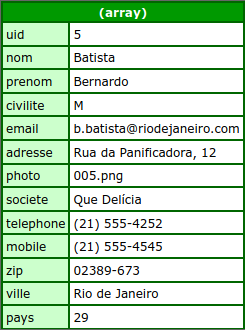

[↑ Top](#top)

* * * * *

Mysql Results Object
--------------------
Force type with second parameter 'mysql'

```php
<?php
    $dblink = mysqli_connect($host, $user, $pw);
    $dblink->set_charset( 'utf8' );
    $dblink->select_db( $db );
    $dbres = $dblink->query("SELECT * FROM `contact` LIMIT 1,3");
    new Dbg\dBug2( $dbres, 'mysql' );
    $dbres->free();
    mysqli_close($dblink);
?>
```
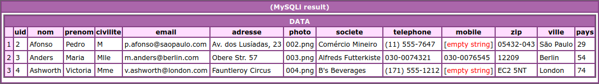

[↑ Top](#top)

* * * * *

Object variable
---------------

```php
<?php
    class Foo
    {
        public $bar = 'property1';
        public $doe = 'property2';
        public function method1(): string {
            return 'method';
        }
    }
    $obj = new Foo();
    new Dbg\dBug2($obj);
?>
```
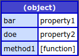

[↑ Top](#top)

* * * * *

JSON
----
Force type with second parameter 'json'

```php
<?php
    $json = file_get_contents('./sample.json');
    new Dbg\dBug2($json, 'json');
?>
```
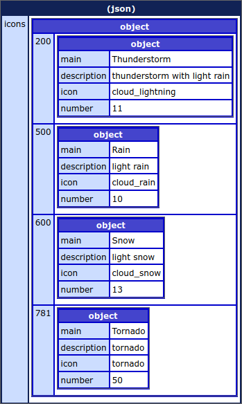

[↑ Top](#top)

* * * * *

PostgreSQL resource
-------------------

```php
<?php
    $conn = pg_pconnect("host=localhost port=5432 dbname=Authenticate user=dbadmin password=pass");
    $res = pg_query($conn, "SELECT id, migration, batch FROM capture.migrations LIMIT 5 OFFSET 1");
    new Dbg\dBug2($res);
?>
```
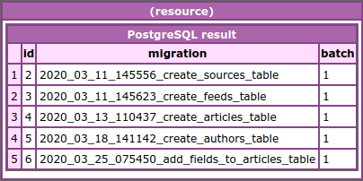

[↑ Top](#top)

* * * * *

XML variable
------------

Force type with second parameter 'xml'

```php
<?php
    if (file_exists('sample.xml')) {
        new Dbg\dBug2('sample.xml', 'xml');
    }
?>
```
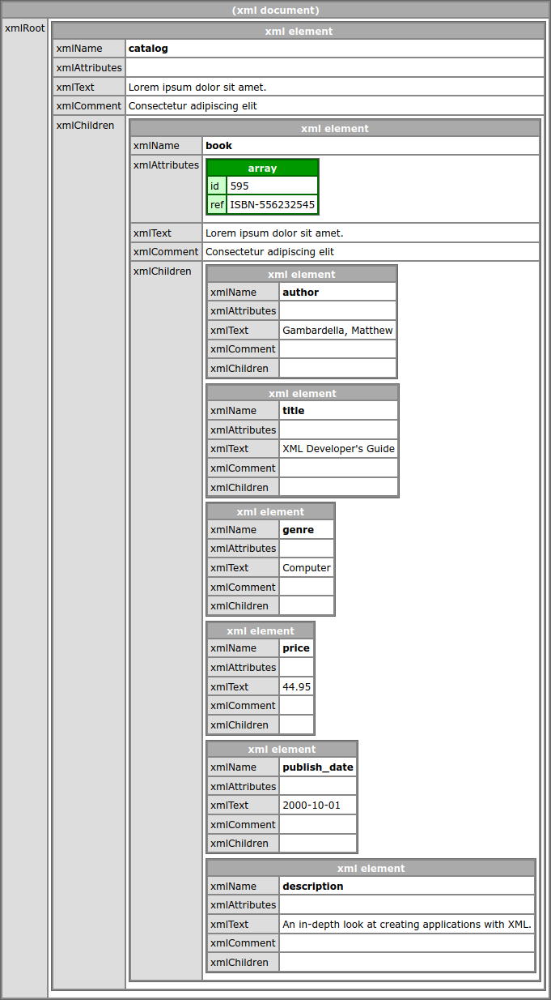

[↑ Top](#top)

* * * * *

GD Image resource
-----------------

```php
<?php
    $image = imagecreatefrompng('./imgs/brown-hummingbird.png');
    new Dbg\dBug2($image);

    $image2 = imagecreatefromgif('./imgs/cat.gif');
    new Dbg\dBug2($image2);
?>
```
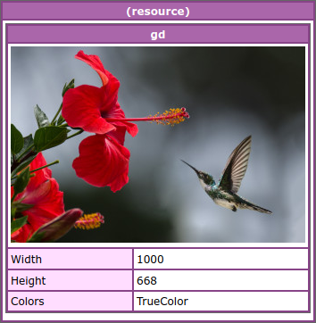

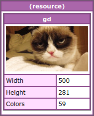

[↑ Top](#top)

* * * * *

Exif Image information
----------------------

Force type with second parameter 'image'

```php
<?php
        $filename1 = './imgs/charles-deluvio-K4mSJ7kc0As-unsplash.jpg';
        new Dbg\dBug2($filename1, 'image');

        $filename2 = './imgs/cat.gif';
        new Dbg\dBug2($filename2, 'image');
?>
```
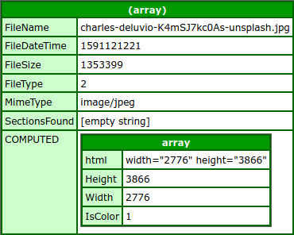


[↑ Top](#top)
